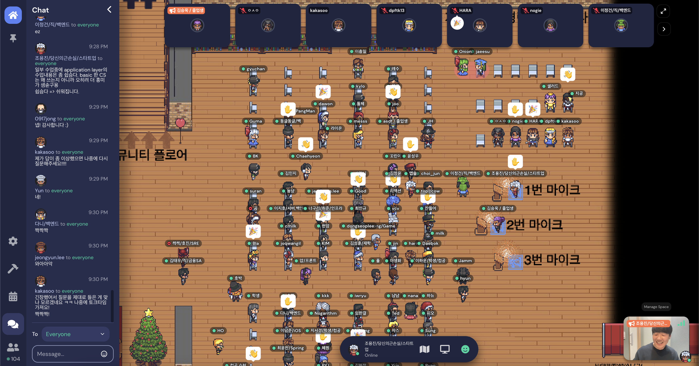

# 가천대 IT 경력개발 세미나

###  세부 사항
안녕하세요. 가천대학교 IT 스타트업 경력개발방의 모임 (22년 02월) 개최합니다. 본 모임은 가천대학교 출신의 재학생과 졸업생을 대상으로 IT 관련된 주제로 경험을 공유하는 모임입니다. 자원 발표자들의 다양한 발표 주제에 대해 토론 및 질문/답변을 주로 하는 모임입니다. 어렵게 생각할 것 없이, 재밌는 시간이 되길 바랍니다!

### 커뮤니티 정보
오픈카톡방: https://open.kakao.com/o/gxnZ4Z3b
비밀번호: 갗대인만 아는거 그 건물: (****** TOWER)

# 2번째 모임 (2022년 2월 22일 화요일 오후 8시)

- [참가신청 Link](https://forms.gle/Ggkkpyn1nQjzUzVEA)
- [모임장소 Link](https://app.gather.town/app/gzYJQgKQYV0JBWnS/gachon-it-career): 비밀번호는 참가한사람에게 이메일로 감

### slots
- Slot1 = (학부생중에 진행해본 공모전 경험/꿀팁 전수해주실 연사님 구해요)
- Slot2 = 조용진(당근마켓:서버개발) - 학부레벨로 '검색'기능 쉽게 만들기 / 학부레벨로 '검색'기능 열심히 만들기 [LINK1](./docs/20220329_lets_make_search.pdf) [LINK2](./docs/20220329_elasticsearch_araboza.pdf)
- Slot3 = 이정윤(? _ ?) - 자유주제
- Slot4 = 심호진(? _ ?) - 자유주제/(이력서/면접 관련)

# [종료] 1번째 모임 (2022년 2월 22일 화요일 오후 8시)

- [참가신청 Link](https://forms.gle/segDRczDSAwQAG5a9)
- [모임장소 Link](https://app.gather.town/app/gzYJQgKQYV0JBWnS/gachon-it-career): 비밀번호는 참가한사람에게 이메일로 감

### slots
- Slot1 = 조용진(당근마켓:서버개발) - 모임소개 / 개회사 / 발표주제
- Slot2 = 한결(가천대 단대장) - 자유주제
- Slot3 = 강경수(스타트업) - 가칭: 네이버 부스트캠프 이야기 [Link](./docs/20220222_kakasoo_how_to_study.pdf)
- Slot4 = 김승욱(당근마켓:프론트) - 자유주제

### gallary

[1회차의 이미지 보기](./images/20220222/README.md)

------------------------------------------------------

# 모임 규칙

1. 누구나 멘토이며 멘티에요
2. 질문 하기전에 한번만 더 찾아보거나 고민정도는 해보도록해요
3. 기본적으로는 실명인데, 실명을 원치 않으면 익명도 괜찮아요
4. 모임의 토픽과 벗어나는 주제로 과열된 토론은 지양해요
5. 너무 둘만 대화하면 저희 외로워요.
6. 새벽시간에도 대화해도 좋아요. 학구열에는 밤낮이 없어요 (알람관리는 본인이 하도록)
7. 연인상대는 여기에서 찾지마요 ㅠ
8. 운영제안은 자유롭게 해주세요! 완전환영해요!
9. 이 방에서 기획하고싶은게 있나요? 공익적이라면 일단 진행하세요!
10. 부방장은 방 운영에 관심이 많은 사람에게 부여하고있어요! 원하신다면 말씀해주세요~!
11. 이 방은 필요하면 들어오고, 필요없으면 나가도 됩니다. 자유롭게 해주세요. 부담갖지말아주세요.
12. 특히 졸업생과 경력자의 꼰대질은 바로 강퇴입니다. 반말도 지인이 아니면 함부로 하면 안돼용.
13. 구인, 구직 완전 자유롭게 해주세요. 제발 해주세요. 특히 헤커톤 멤버나 졸프멤버 꼭 찾아가세요.

# 시덥잖은 이야기 - 이 세미나 커지면 지울거임
컴퓨터미융 11학번 졸업생 조용진이라고 합니다.
저는 당근마켓에 검색개발자로 재직중에 있으며, 개발과 스타트업에 대한 이야기를 좋아합니다.

동문의 졸업생들을 모아서 재학생의 후학양성 및 커뮤니케이션을 취지로 카카오톡 오픈 채팅방을 만들었었습니다. 제 재학생때 진로고민으로 고생을 했었는데, 뭔가 경력자분들이나 졸업자분들이 같이 고민해주었으면 하는 부분들이 많았었어요. (결국 인터넷 커뮤니티에 글써보고, 경력자분들 만나가며 고민에 대한 최선의 답을 찾으며 다녔었어요.)

- 커리어 패스(공부 방향)를 어떻게 짜야하나
- 자소서/포트폴리오 어떻게 짜는게 좋지..?
- 휴학을 하고 실력을 더 키울까?
- 등...

처음에는 이 방에는 5명의 직딩과 10명의 취준 재학생으로 시작했는데, 어떻게 하다보니 지금은 204명이 모인 방으로 성장하게 되었습니다. 인원 구성은 졸업생이 절반이고, 그 절반은 재학생이 들어와있어요. 아마.. 저 보다 더 뛰어나신분들이 이 방에서 좋은 인사이트를 나눠주고 계시다보니 나가지 않고 계속해서 들어와 주시는거 같아요 ㅋㅋㅋ  (진심으로 감사합니다)
